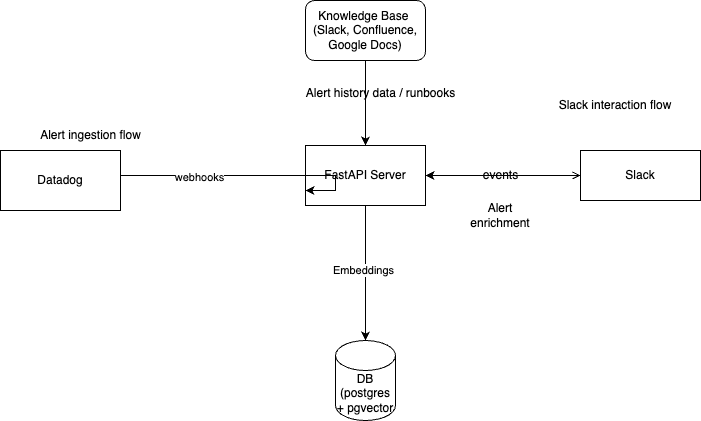

<p align="center">
  
</p>

<p align="center">
  <a href="https://youtu.be/m_K9Dq1kZDw">Demo</a> - <a href="https://opslanecommunity.slack.com">Slack</a>
</p>

# Opslane

Opslane is a tool that helps make the on-call experience less stressful.

It reduces alert fatigue by classifying alerts as actionable or noisy and providing contextual information for handling alerts.

## Demo


[](https://youtu.be/m_K9Dq1kZDw)


## Key Features

- **Alert Classification**: Opslane can classify alerts as actionable or noisy using LLMs. We analyze alert history and Slack conversations to determine if an alert is actionable.
- **Slack Integration**: Opslane operates in a Slack channel where a team receives alerts. We provide insights and additional resources for debugging actionable alerts.
- **Analytics**: Opslane provides weekly reporting data for the quality of alerts in a Slack channel. We analyze the pattern of alerts and provide an option to silence noisy alerts directly from Slack.
- **Open Source**: Opslane is open source and welcomes contributions from the community.


## Architecture

Opslane uses a modular architecture designed for efficient alert processing and seamless integration with existing tools:

1. **Alert Ingestion**: Datadog sends alerts via webhooks to our FastAPI server.
3. **FastAPI Server**: The core of our system, processing incoming alerts, interacting with Slack, and managing data flow.
4. **Slack Integration**: Provides a user interface for alert management and interaction.
5. **Database**: Utilizes Postgres with pgvector for storing alert data and embeddings.

Here's a high-level overview of the Opslane architecture:



### Integrations

We use a flexible data model so that we can support multiple integrations. Currently, Opslane supports Datadog.

## Installation

### Prerequisites

- Docker
- Slack workspace
- Datadog account

### Setup

1. Clone the repository:
```bash
   git clone https://github.com/yourusername/opslane.git
```

2. Configure environment variables:

```bash
bash
cp .env.example .env
# Edit .env with your Slack, Datadog, and OpenAI API keys
```


3. Build and run the Docker container:

```bash

   docker-compose up --build

```

## Usage

1. Add the Opslane bot to the Slack channel where you receive alerts
2. Configure Datadog to send alerts to Opslane's webhook endpoint
3. Opslane will automatically analyze incoming alerts and post insights in your Slack channel


